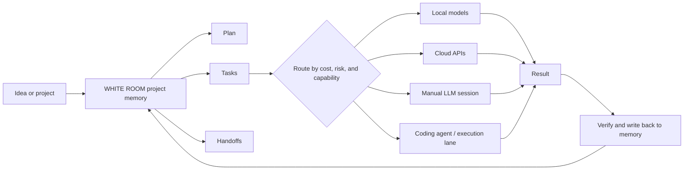
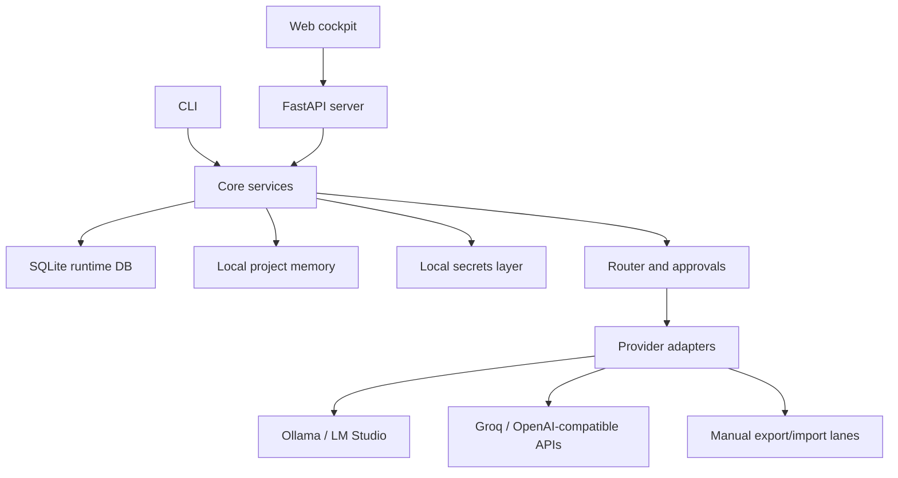

# WHITE ROOM

Local-first AI workbench for building serious projects with lower cost, clearer structure, and stronger privacy.

WHITE ROOM is for people who use AI frequently and want to build production-grade work without burning through expensive model limits, losing context across chats, or sending every file to every provider. It turns a project into memory, tasks, routes, approvals, and handoffs, then lets each part of the work use the cheapest capable model.

> Status: alpha skeleton with working provider lanes, local project memory, task packets, model routing, approval gates, and a live cockpit UI. It is designed to be extended locally.

## Why It Exists

AI usage is now constant: planning, writing, coding, debugging, research, interviews, operations, and automation. The problem is that most tools still treat every interaction like one long chat.

That creates real pain:

- Expensive models get wasted on repeatable execution work.
- Long threads become messy and hard to reuse.
- Context is lost when users switch models or tools.
- Local files and project knowledge are scattered across chats.
- Beginners do not know how to break a project into safe, shippable phases.
- Power users need routing, approvals, and provider visibility instead of a black box.

WHITE ROOM is built around a different workflow: plan the work, split it into tasks, route each task to the right model, preserve local memory, and keep users in control of cost and privacy.

## What Makes It Different

Most open-source AI tools are chat frontends, Ollama dashboards, agent runners, or API routers. WHITE ROOM is a project cockpit above those layers.

- Project-first memory instead of chat-only history.
- Cost-aware model routing instead of sending everything to the most expensive model.
- Local files, brain notes, tasks, packets, decisions, and handoffs stored on disk.
- Manual, local, and cloud lanes in one workflow.
- Approval gates before sensitive or costly live calls.
- Provider health, model sync, and route transparency.
- Task packets that let agents execute scoped work without rereading the whole project.
- Designed for local extension instead of a hosted black box.

## Core Idea

High-capability models should handle reasoning, planning, and hard decisions. Cheaper, free, or local models should handle drafting, summaries, repetitive execution, test explanations, and low-risk work. WHITE ROOM keeps enough shared project memory locally so those lanes can cooperate without every model receiving the entire expensive context.



## Current Capabilities

- Dark cockpit UI for project-centered chat.
- Project memory files for status, architecture, decisions, tasks, errors, routes, and handoffs.
- Conversation and task packet flow.
- Local model lane via Ollama.
- LM Studio compatible local lane.
- Manual planning lane for copy/paste LLM sessions.
- OpenAI-compatible cloud/provider abstractions.
- Groq Cloud live lane with key storage, model sync, and model picker.
- Custom OpenAI-compatible gateway lane for private routing setups.
- Provider settings with presence-only key fingerprints.
- Secret redaction helpers and secret-leak tests.
- Route decisions with lane, mode, risk, size, and rationale.
- Approval grants for live provider usage.
- Bench fixtures for evaluating task-type behavior.

## What This Is Not Yet

WHITE ROOM is not a finished hosted SaaS and it is not a promise of unlimited free AI. It is a local-first skeleton for people who want to own and extend their workflow.

The current alpha still needs:

- Cleaner public demo data.
- Stronger provider-specific error handling.
- More model compatibility rules.
- Better large-prompt chunking and summarization.
- More screenshots and guided demo flows.
- Packaging polish for non-developer users.

See [ROADMAP.md](ROADMAP.md).

## Architecture



Read the detailed architecture in [docs/ARCHITECTURE.md](docs/ARCHITECTURE.md).

## Quick Start

Requires Python 3.11+.

```powershell
python -m venv .venv
.\.venv\Scripts\Activate.ps1
pip install -e ".[dev]"
```

Create or initialize a project:

```powershell
python -m cli.main new white-room
```

Run the web cockpit:

```powershell
python -m uvicorn web.server:app --host 127.0.0.1 --port 8765
```

Open:

```text
http://127.0.0.1:8765/chat/white-room
```

## Provider Setup

WHITE ROOM does not require cloud keys for local-only use.

Optional provider environment variables:

```powershell
OLLAMA_BASE_URL=http://127.0.0.1:11434
LMSTUDIO_BASE_URL=http://127.0.0.1:1234/v1
GROQ_API_KEY=your-groq-key
CUSTOM_OPENAI_BASE_URL=https://your-provider.example/v1
CUSTOM_OPENAI_API_KEY=your-provider-key
```

The Settings UI can store local keys in `secrets.local.json`, which is ignored by git. Keys are displayed only as fingerprints.

See [docs/PROVIDERS.md](docs/PROVIDERS.md).

## Public Demo Mode

For a public GitHub release, do not publish local runtime state. Use demo data and fake provider keys only.

The repo includes a publication guide at [docs/PUBLIC_RELEASE.md](docs/PUBLIC_RELEASE.md).

## Security Posture

WHITE ROOM is local-first by design:

- Runtime database stays local.
- Project memory stays local.
- Provider keys stay in environment variables or `secrets.local.json`.
- UI renders key fingerprints, not raw values.
- Approval gates protect live provider calls.
- Tests cover redaction and leak prevention.

Read [SECURITY.md](SECURITY.md) before publishing or deploying.

## Repository Map

```text
adapters/   Provider adapters and compatibility layers
cli/        Local command-line workflows
core/       Project memory, routing, approvals, secrets, tasks
web/        FastAPI app, templates, and cockpit UI
docs/       Public architecture, provider, and release docs
tests/      Regression, routing, provider, and security tests
bench/      Offline benchmark fixtures
templates/  Project and brain templates
projects/   Local project memory; treat as private runtime data for public releases
data/       Local SQLite runtime data; never publish
```

## Verification

Run targeted tests:

```powershell
python -m pytest tests/test_phase15_secrets.py tests/test_settings_providers.py tests/test_phase15_groq_models_and_gates.py -q
```

Run the broader suite when preparing a release:

```powershell
python -m pytest -q
```

## License

MIT. See [LICENSE](LICENSE).

MIT allows reuse, modification, and distribution while preserving the copyright notice. If you want a license that prevents commercial copying or closed-source redistribution, MIT is not that license.

## Attribution

If you use WHITE ROOM or build from its workflow concept, please keep the copyright notice and cite the project. See [NOTICE.md](NOTICE.md) and [CITATION.cff](CITATION.cff).
