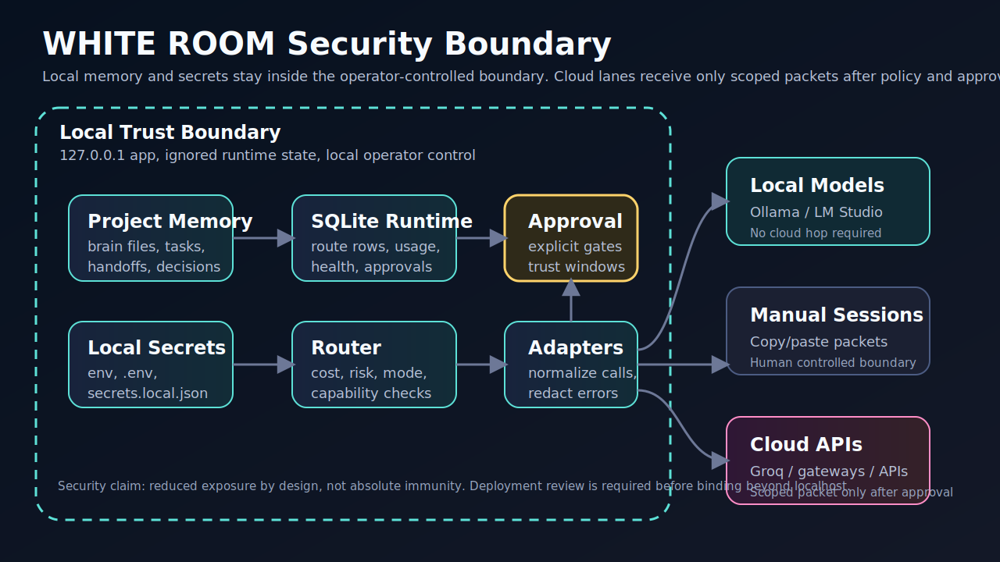
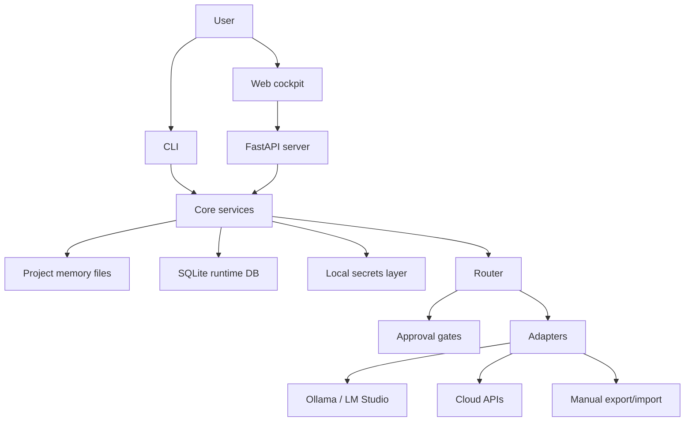
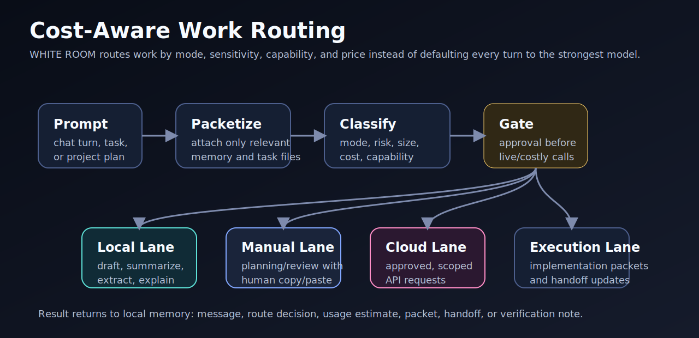
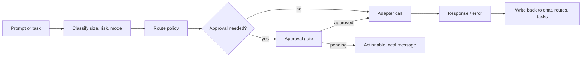

# Architecture

WHITE ROOM is a local-first workbench made of four layers:

1. Project memory
2. Routing and approvals
3. Provider adapters
4. Cockpit UI and CLI

The design goal is to reduce wasted context and provider cost by keeping durable project state locally, then sending only the right packet of work to the right lane.

## System View

## Project Memory

Every project can keep a local `brain/` folder with:

- `business_scope.md`
- `architecture.md`
- `active_plan.md`
- `tasks.md`
- `decisions.md`
- `errors.md`
- `model_routes.md`
- `verification.md`
- `handoffs.md`
- `current_status.md`

This lets WHITE ROOM route small task packets instead of pushing the whole conversation to every model.

## Routing

Routing considers:

- mode: ask, plan, execute, review, summarize
- lane override
- task size
- risk
- provider availability
- approval grants
- model catalog
- local fallback options

## Adapters

Adapters hide provider-specific transport details:

- local adapters for Ollama and LM Studio
- manual adapter for copy/paste planning flows
- OpenAI-compatible cloud adapters
- Groq Cloud adapter
- custom gateway adapter for private OpenAI-compatible routing

Adapters should normalize:

- health checks
- model discovery
- chat calls
- streaming behavior
- usage estimates
- error categories
- secret redaction

## Security Boundaries

Local by default:

- SQLite stays in `data/`
- secrets stay in env, `.env`, or `secrets.local.json`
- project memory stays in `projects/`
- cloud calls require explicit keys and approval flow

Public releases should export a sanitized snapshot rather than publishing runtime state.

## Extension Points

Useful places to extend:

- `adapters/` for providers
- `core/router.py` for lane policy
- `core/approvals.py` for trust windows
- `core/models_catalog.py` for model capability normalization
- `templates/` for new project types
- `bench/fixtures/` for evaluation tasks
