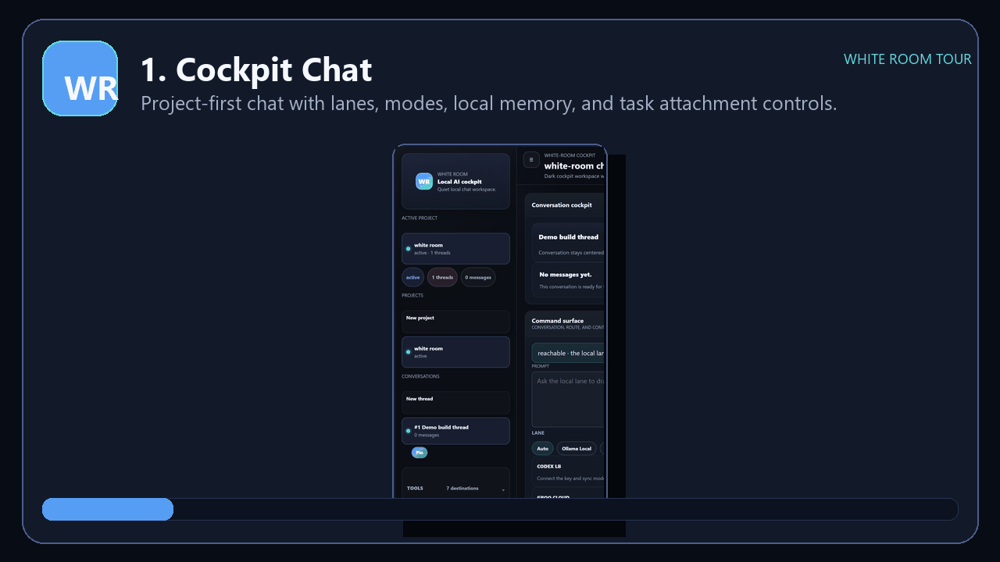
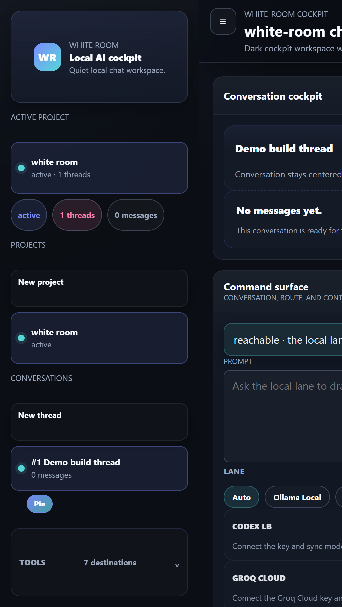
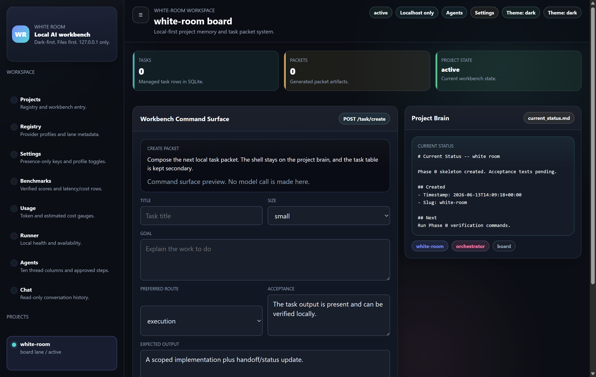
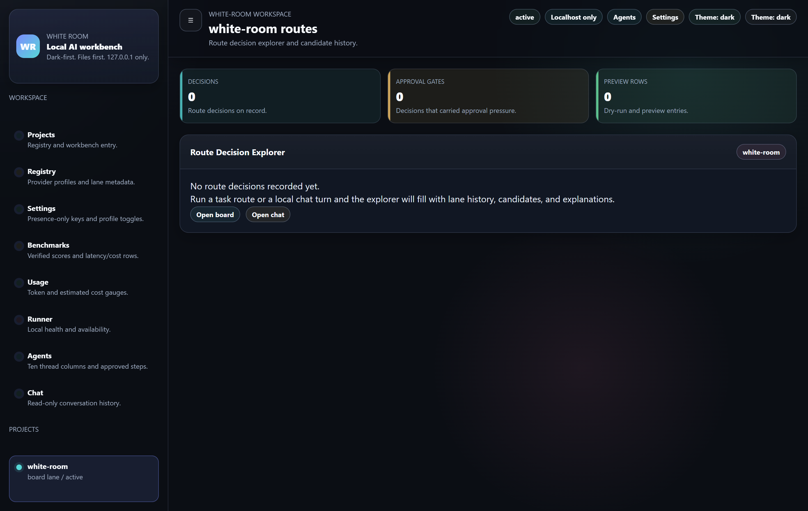
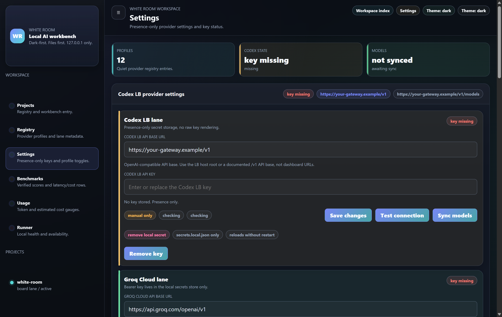
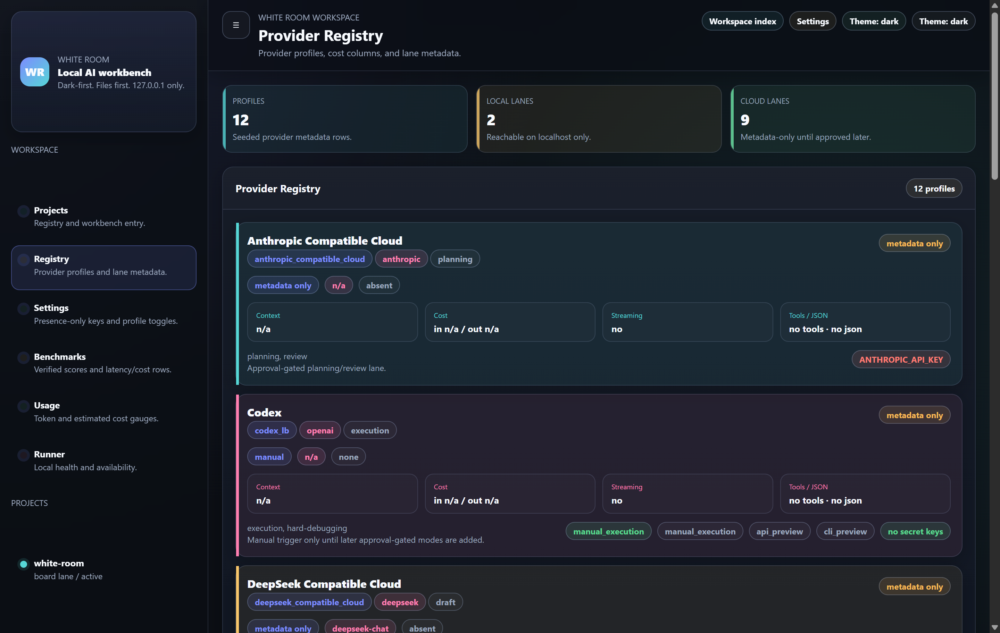
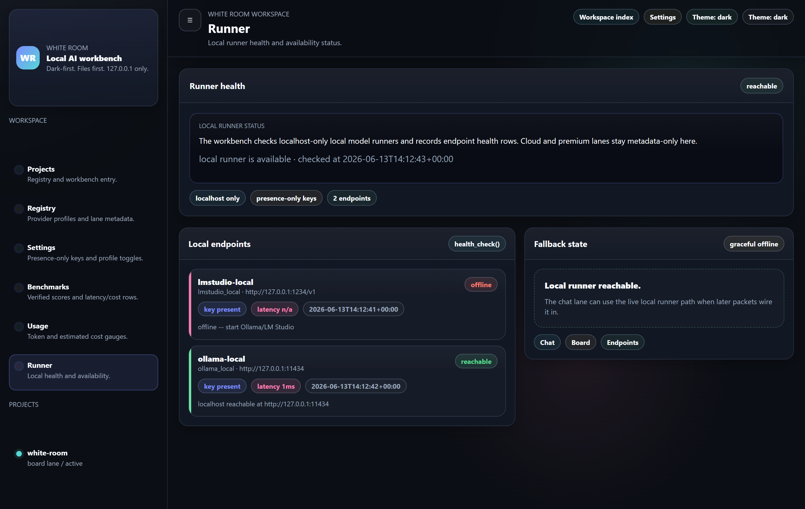
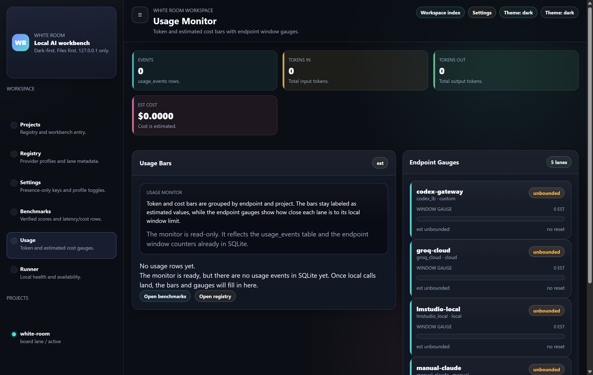

# Product Tour

This tour uses screenshots captured from a clean local demo runtime. The screenshots intentionally avoid private project memory, API keys, personal paths, account dashboards, and real conversations.

## 1. Cockpit Chat

The cockpit keeps the conversation centered while lanes, modes, task packet controls, and provider availability remain visible. The default workflow is local-first: chat, attach scoped memory, choose a lane, and keep route context nearby.

## 2. Task Packet Board

The board turns a project plan into task packets. This is the core cost-control mechanism: a high-capability model can produce a plan, then lower-cost lanes can execute scoped packets with less repeated context.

## 3. Route Explorer

The route explorer is where route decisions, candidate lanes, approval pressure, and fallback explanations become inspectable. In a fresh demo it starts empty; real routed turns populate this view.

## 4. Provider Settings

Provider settings are presence-only. The UI shows whether a key exists, but does not render raw values. Dashboard URLs are rejected or normalized to API base URLs.

## 5. Endpoint Registry

The endpoint registry shows local, manual, cloud, and custom gateway lanes in one place. This is the routing surface that lets a user decide which work belongs on local models, manual sessions, custom gateways, or cloud APIs.

## 6. Runner Health

The runner health page checks local model availability separately from cloud providers. Localhost runners are treated as local capability, while remote lanes remain explicit and gated.

## 7. Usage Monitor

Usage monitoring keeps token and cost values visible as estimates. This makes cost pressure part of the workflow instead of a surprise after the work is done.

