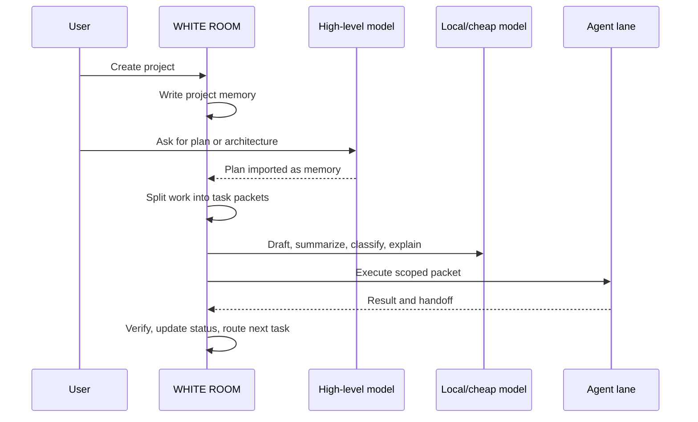

# Workflows

WHITE ROOM is built around a simple idea: do not send every task to the most expensive model.

## Build Workflow

## Cost-Saving Pattern

1. Use a strong model to create the plan.
2. Save the plan locally.
3. Split the plan into small tasks.
4. Route simple tasks to local or cheap models.
5. Use stronger models only for architecture, hard debugging, or final review.
6. Keep decisions and handoffs local so future prompts can be shorter.

## Privacy Pattern

1. Keep files local.
2. Attach only relevant memory files.
3. Use task packets instead of full project dumps.
4. Gate cloud calls.
5. Redact secrets before logging or rendering.
6. Use manual lanes when an API key is unavailable or not desired.

## Beginner Pattern

WHITE ROOM can guide a new builder through:

- scope
- architecture
- task breakdown
- model route
- implementation packet
- verification
- handoff
- next step

This gives structure before the user starts asking random disconnected chat questions.

## Power User Pattern

Advanced users can add:

- local models for low-cost work
- cloud models for high-capability calls
- custom gateways
- route policies
- benchmark fixtures
- approval windows
- project templates
